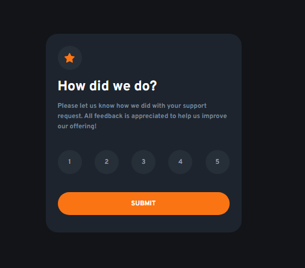

# Frontend Mentor - Interactive rating component

This is a solution to the [Interactive rating component challenge on Frontend Mentor](https://www.frontendmentor.io/challenges/interactive-rating-component-koxpeBUmI). Frontend Mentor challenges help you improve your coding skills by building realistic projects.

### Overview
Select a rating from 1 to 5. The rating you chose will be revealed when you press submit.

### Screenshot

### Links
- Live site URL: [GitHub](https://sifrult.github.io/interactive-rating-component/)
